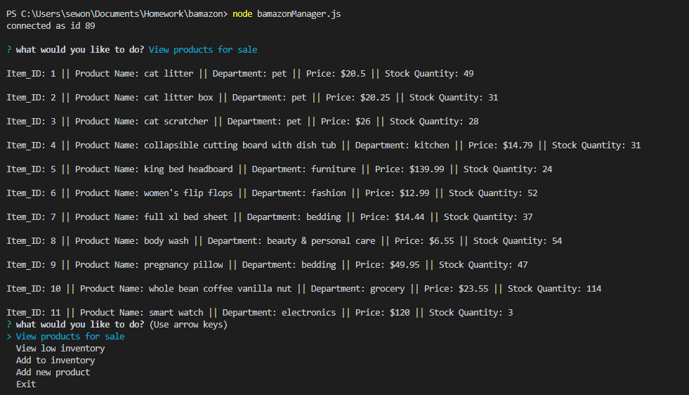
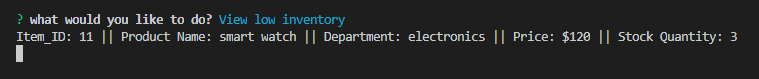
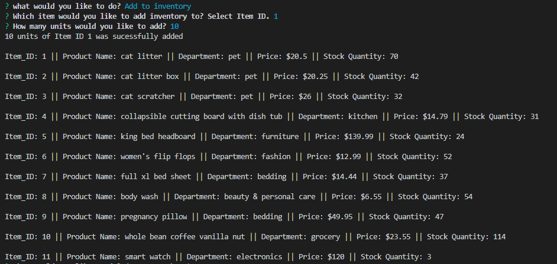
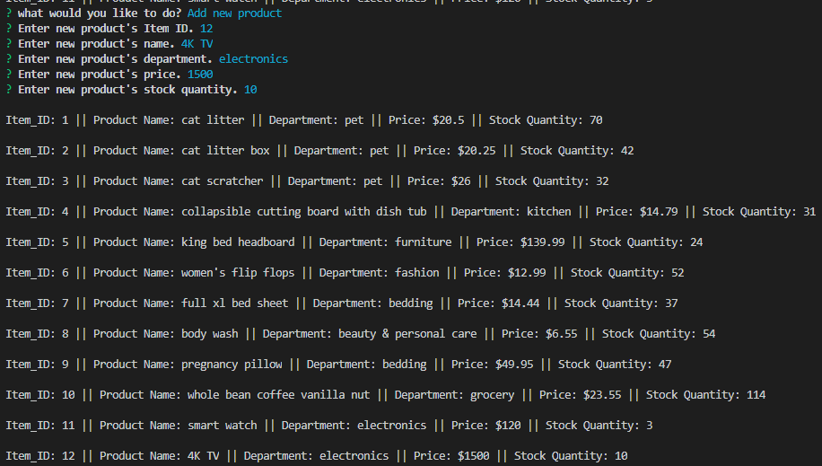

# bamazon
Bamazon is a storefront that takes in orders from customers and deplete stock from the store's inventory.

## Installs
To retrieve the data that will power this app, you'll need to install below package in the same folder where the app is saved.

* mySQL:
npm install spotify

## Customer
When the app launches (node bamazonCustomer.js), it will ask user what they would like to do ("buy something", "exit").

### Display items available for sale

If you choose "buy something", the app will show the available item information including Item ID, Product Name. Department, Price, Stock Quantity and ask for the item id and order quantity.

 

### Place an order
You will be asked to provide the Item ID of the product you would like to purchase. 
After you provide the Item ID, you will be asked again to provide the quantity you would like to purchase.

### Inventory Checking
After you provide the quantity, the app will check if the order can be fulfilled based on the current stock available.
If the order quantity is bigger than the stock available, then the order will not be placed, and you will be asked to place a new order.
If the order quantity is equal or smaller than the available stock, the order will be placed.
 

### Update Inventory
After the order is successfully placed, the Stock Quantity for the item you purchased will be updated. 
The app will ask if you would like to place a new order.
 

### Demo Video
https://drive.google.com/file/d/1V82pg5DfQKWHi7sKu_-cup60Q8_DzIrD/view?usp=sharing

## Manager
When the app launches, it will ask user what they would like to do
* View products for sale
* View low inventory
* Add to inventory
* Add new product
* Exit
### Display items available for sale
When View products for sale is selected, the app will show the available item information including Item ID, Product Name. Department, Price, Stock Quantity

 

### View low inventory
When View low inventory is selected, the app will show the available item information with inventory fewer than 5. 

 

### Add to inventory
When Add to inventory is selected, the app will ask for the Item ID that you would like to add inventory to and the quanity. Once you provide the input, the app will update the product's Stock Quantity.

 

### Add new product
When Add to inventory is selected, the app will ask for the Item ID, Product Name, Department, Price, and Stock Quantity of the new product that you would like to add. Once you provide the input, the app will update the products data table with new product information.

 

